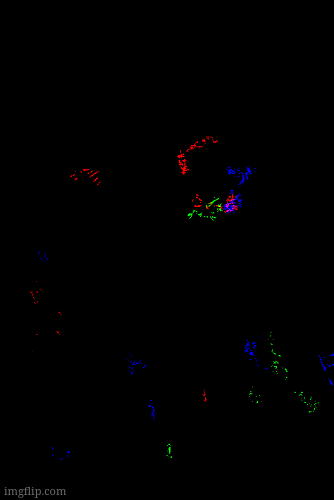

# ABOUT

Implementation of Ant Colony Optimization for edge detection as a Numpy-dependent python library using Numpy-API.[^notes]
It has the following Methods:

- **a**co : It is used to detect edges based upon the Difference of **A**bsolute Value with adjacent positions.
- **r**aco : It is used to detect edges based upon the Difference of **R**elative Value with adjacent positions.

# PARAMETERS

- ANTS: The number of ants used to find edges
- ITERATIONS:   The total interations allowed to each ant
- NEIGHBOURS:   The critical number of neighbours that trigger edge detection if found to have a RGB value diffrence more than `sensitivity`
- SENSITIVITY:  The value difference in current point of ant and surrounding points to trigger marking as an edge

# INSTALLATION

- Install numpy and matplotlib
- Run `numpy.__path__`
- Compile alg.c as shared with local install of python & the numpy/core/include of numpy as found above. Use -fPIC flag to force it in gcc.
- Create a `makefile` to automate this. `Bear` can be use to make config files for auto-suggest 
- Make sure the file is .png
- al.py will give a meta-edge by combining all streams and al2.py will give edge for a selected stream of chroma only

# IMAGES

 

Variation when Neighbour value changes from 3 to 5
_edges.png) _edges.png)

Edges in Backdrop detected with higher sensitivity at the cost of noise in foreground
_edges.png)

The `raco` used on Red Color Stream to detect Edges
_r_edges.png)

[^notes]:
- Currently only accepts `.png`.
- Requires Pre-processing and Post-processing _Python_ files give a footprint of usage.
